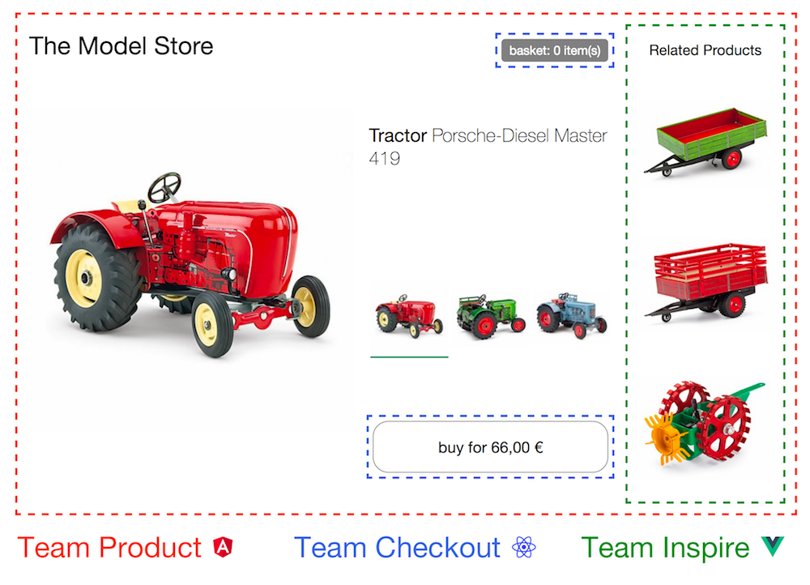

## 什么是微前端？
> Techniques, strategies and recipes for building a modern web app with multiple teams that can ship features independently. -- [Micro Frontends](https://micro-frontends.org/)
> 
> 微前端是一种多个团队通过独立发布功能的方式来共同构建现代化 web 应用的技术手段及方法策略。

微前端（Micro-Frontends）是一种类似于微服务的架构，它将微服务的理念应用于浏览器端，即将 Web 应用由单一的单体应用转变为多个小型前端应用聚合为一的应用。各个前端应用还可以独立运行、独立开发、独立部署，从而满足业务快速变化及分布式多团队并行开发的需求。
微前端不是单纯的前端框架或者工具，而是一套架构体系，这个概念最早在2016年底由ThoughtWorks提出。

## 核心价值
* **技术栈无关**
  
  主应用不限制接入子应用的技术栈，子应用拥有完全自主权。应用之间不应该有任何直接或间接的技术栈、依赖、以及实现上的耦合。
  
* 独立开发、独立部署
  
  微应用仓库独立，前后端可独立开发，部署完成后主框架自动完成同步更新。独立部署的能力在微前端体系中至关重要，能够缩小变更范围，进而降低相关风险。
  各个微前端都应该有自己的持续交付管道；这些管道可以将微前端构建、测试并部署到生产环境中。
  
* 增量升级
  
  在面对各种复杂场景时，我们通常很难对一个已经存在的系统做全量的技术栈升级或重构，而微前端是一种非常好的实施渐进式重构的手段和策略。
  逐渐升级我们的架构、依赖关系和用户体验。当主框架发生重大变化时每个微前端模块都可以按需升级，不需要整体下线或一次性升级所有内容。如果我们想要尝试新的技术或互动模式，也能在隔离度更好的环境下做试验。
  
* 简单、解耦、易维护
  
  微前端架构下的代码库倾向于更小/简单、更容易开发，避免无关组件之间不必要的耦合，让代码更简洁。通过界定清晰的应用边界来降低意外耦合的可能性，更好地避免无意间造成的这类耦合问题。

更多参考文献：

* [Micro Frontends](https://micro-frontends.org/)
* [Micro Frontends from martinfowler.com](https://martinfowler.com/articles/micro-frontends.html)
* [微前端的核心价值](https://zhuanlan.zhihu.com/p/95085796)

## 在什么场景下使用？
> 微前端架构旨在解决单体应用在一个相对长的时间跨度下，由于参与的人员、团队的增多、变迁，从一个普通应用演变成一个巨石应用(Frontend Monolith)后，随之而来的应用不可维护的问题。这类问题在企业级 Web 应用中尤其常见。
* 兼容遗留系统
  
  在现在技术不断更迭，保证技术栈不落后，需要在兼容已有系统的前提下，使用新框架去开发新功能。遗留系统功能已经完善，并且稳定运行，团队没有必要，也没有精力去将遗留系统重构一遍。此时团队如果需要使用新框架，新技术去开发新的应用，使用微前端是很好的解决方案。

* 应用聚合
  
  大型的互联网公司，或商业Saas平台，都会为用户/客户提供很多应用和服务，如何为用户呈现具有统一用户体验和一站式的应用聚合成为必须解决的问题。
  前端聚合已成为一个技术趋势，目前比较理想的解决方案就是微前端。
  
* 不同团队间开发同一个应用技术栈不同

  把第三方的SaaS应用进行集成或者把第三方私服应用进行集成（比如在公司内部部署的 gitlab）等。以及在已有多个应用的情况下，需要将它们聚合为一个单应用。


## 什么是qiankun？
qiankun 是一个基于 [single-spa](https://github.com/CanopyTax/single-spa) 的[微前端](https://micro-frontends.org/)实现库，旨在帮助大家能更简单、无痛的构建一个生产可用微前端架构系统。

qiankun 孵化自蚂蚁金融科技基于微前端架构的云产品统一接入平台，在经过一批线上应用的充分检验及打磨后，我们将其微前端内核抽取出来并开源，希望能同时帮助社区有类似需求的系统更方便的构建自己的微前端系统，同时也希望通过社区的帮助将 qiankun 打磨的更加成熟完善。

目前 qiankun 已在蚂蚁内部服务了超过 200+ 线上应用，在易用性及完备性上，绝对是值得信赖的。

- 📦 **基于 [single-spa](https://github.com/CanopyTax/single-spa)** 封装，提供了更加开箱即用的 API。
- 📱 **技术栈无关**，任意技术栈的应用均可 使用/接入，不论是 React/Vue/Angular/JQuery 还是其他等框架。
- 💪 **HTML Entry 接入方式**，让你接入微应用像使用 iframe 一样简单。
- 🛡​ **样式隔离**，确保微应用之间样式互相不干扰。
- 🧳 **JS 沙箱**，确保微应用之间 全局变量/事件 不冲突。
- ⚡️ **资源预加载**，在浏览器空闲时间预加载未打开的微应用资源，加速微应用打开速度。
- 🔌 **umi 插件**，提供了 [@umijs/plugin-qiankun](https://github.com/umijs/plugins/tree/master/packages/plugin-qiankun) 供 umi 应用一键切换成微前端架构系统。
> 摘自qiankun介绍
## 遇到的问题
### 子应用静态资源404
1. 所有图片等静态资源上传至 cdn，css 中直接引用 cdn 地址（推荐）
2. 将字体文件和图片打包成 base64（适用于字体文件和图片体积小的项目）(但总是有一些不符合要求的资源，请使用第三种)
```js
// webpack config loader, 添加以下rule到rules中
{
  test: /\.(png|jpe?g|gif|webp|woff2?|eot|ttf|otf)$/i,
  use: [{
    loader: 'url-loader',
    options: {},
  }]
}
// chainWebpack
config.module.rule('fonts').use('url-loader').loader('url-loader').options({}).end();
config.module.rule('images').use('url-loader').loader('url-loader').options({}).end();
```
3. 在打包时给其注入完整路径（适用于字体文件和图片体积比较大的项目）
```js
const absolutePath = '子应用万维网可访问url';
const publicPath = `${absolutePath}${config.output.get('publicPath')}`;
    config.module
      .rule('fonts')
      .use('url-loader')
      .loader('url-loader')
      .options({
        limit: 4096, // 小于4kb将会被打包成 base64
        fallback: {
          loader: 'file-loader',
          options: {
            name: 'fonts/[name].[hash:8].[ext]',
            publicPath
          }
        }
      })
      .end();
    config.module
      .rule('images')
      .use('url-loader')
      .loader('url-loader')
      .options({
        limit: 4096, // 小于4kb将会被打包成 base64
        fallback: {
          loader: 'file-loader',
          options: {
            name: 'img/[name].[hash:8].[ext]',
            publicPath
          }
        }
      });
```
### css样式隔离
默认情况qiankun会自动开启沙箱模式，但这个模式无法隔离主应用与子应用、或者同时加载多子应用的场景。
qiankun还给出了shadow dom的方案，需要配置`sandbox: { strictStyleIsolation: true }`

> 基于 ShadowDOM 的严格样式隔离并不是一个可以无脑使用的方案，大部分情况下都需要接入应用做一些适配后才能正常在 ShadowDOM 中运行起来比如 react 场景下需要解决这些[问题](https://github.com/facebook/react/issues/10422) ，使用者需要清楚开启了 strictStyleIsolation 意味着什么。下面会列出我解决ShadowDom的一些案例。
### js 沙箱
主要是隔离挂载在`window`上的变量，而qiankun内部已经帮你处理好了。在子应用运行时访问的`window`其实是一个`Proxy`代理对象。
所有子应用的全局变量变更都是在闭包中产生的，不会真正回写到 window 上，这样就能避免多实例之间的污染了。

`

### fix shadow dom
- getComputedStyle
  
  当获取shadow dom的计算样式的时候传入的element是`DocumentFragment`,会报错。
```js
const getComputedStyle = window.getComputedStyle;
window.getComputedStyle = (el, ...args) => {
  // 如果为shadow dom则直接返回
  if (el instanceof DocumentFragment) {
    return {};
  }
  return Reflect.apply(getComputedStyle, window, [el, ...args]);
};
 ```

- elementFromPoint

  根据坐标（x, y）当获取一个子应用的元素的时候，会返回shadow root，并不会返回真正的元素。
```js
const elementFromPoint = document.elementFromPoint;
document.elementFromPoint = function (x, y) {
  const result = Reflect.apply(elementFromPoint, this, [x, y]);
  // 如果坐标元素为shadow则用该shadow再次获取
  if (result && result.shadowRoot) {
    return result.shadowRoot.elementFromPoint(x, y);
  }
  return result;
};
```

- document 事件 target 为shadow

  当我们在document添加click、mousedown、mouseup等事件的时候，回调函数中的`event.target`不是真正的目标元素，而是shadow root元素。
```js
// fix: 点击事件target为shadow元素的问题
const {addEventListener: oldAddEventListener, removeEventListener: oldRemoveEventListener} = document;
const fixEvents = ['click', 'mousedown', 'mouseup'];
const overrideEventFnMap = {};
const setOverrideEvent = (eventName, fn, overrideFn) => {
  if (fn === overrideFn) {
    return;
  }
  if (!overrideEventFnMap[eventName]) {
    overrideEventFnMap[eventName] = new Map();
  }
  overrideEventFnMap[eventName].set(fn, overrideFn);
};
const resetOverrideEvent = (eventName, fn) => {
  const eventFn = overrideEventFnMap[eventName]?.get(fn);
  if (eventFn) {
    overrideEventFnMap[eventName].delete(fn);
  }
  return eventFn || fn;
};
document.addEventListener = (event, fn, options) => {
  const callback = (e) => {
    // 当前事件对象为qiankun盒子，并且当前对象有shadowRoot元素，则fix事件对象为真实元素
    if (e.target.id?.startsWith('__qiankun_microapp_wrapper') && e.target?.shadowRoot) {
      fn({...e, target: e.path[0]});
      return;
    }
    fn(e);
  };
  const eventFn = fixEvents.includes(event) ? callback : fn;
  setOverrideEvent(event, fn, eventFn);
  Reflect.apply(oldAddEventListener, document, [event, eventFn, options]);
};
document.removeEventListener = (event, fn, options) => {
  const eventFn = resetOverrideEvent(event, fn);
  Reflect.apply(oldRemoveEventListener, document, [event, eventFn, options]);
};
```

### 复用公共依赖
> 比如企业中的util、core、request、ui等公共依赖，在微前端中，我们不需要每个子应用都加载一次，这样既浪费资源并且还会导致本来单例的对象，变成了多例。

在webpack中配置`externals`。把需要复用的排除打包，然后在`index.html`中加载排除的lib外链（子应用需要在`script`或者`style`标签加上`ignore`属性，有了这个属性，qiankun 便不会再去加载这个 js/css，而子项目独立运行，这些 js/css 仍能被加载）

```html
<link ignore rel="stylesheet" href="//element-ui.css">
<script ignore src="//element-ui.js"></script>
```
```js
externals: {
  'element-ui': {
    commonjs: 'element-ui',
    commonjs2: 'element-ui',
    amd: 'element-ui',
    root: 'ElementUI' // 外链cdn加载挂载到window上的变量名
  }
}
```
### 父子共享（国际化）
应用注册时或加载时，将依赖传递给子项目
```js
// 注册
registerMicroApps([
  {
    name: 'micro-1', 
    entry: 'http://localhost:9001/micro-1', 
    container: '#micro-1', 
    activeRule: '/micro-1', 
    props: { i18n: this.$i18n }
  },
]);
// 手动加载
loadMicroApp({
  name,
  entry,
  container: `#${this.boxId}`,
  props: {
    i18n: this.$i18n
  }
});
```
子应用启动时获取props参数初始化
```js
let { i18n } = props;
if (!i18n) {
  // 当独立运行时或主应用未共享时，动态加载本地国际化
  const module = await import('@/common-module/lang');
  i18n = module.default;
}
new Vue({
  i18n,
  router,
  render
});
```
主应用在注册子应用或者手动加载子应用时把共享的变量通过`props`传递给子应用，子应用在`bootstrap`或者`mount`钩子函数中获取，如果没有从`props`中获取到该变量，子应用则动态加载本地变量。
### keep-alive（Vue）
> 其实并不建议做keepAlive，但是我还是做了，我能说什么...

网上有其他方案，我没有采纳，我在这里说下我的方案吧（综合了网上的方案），使用`loadMicroApp`手动加载和卸载子应用。这里有几个难点：
```js
// microApp.js (可以走CI/CD运维配置，也可以通过接口从服务器获取)
const apps = [{
  name: 'micro-1',
  activeRule: '/micro-1'
}, {
  name: 'micro-2',
  activeRule: '/micro-2',
  prefetch: true
}, {
  name: 'micro-3',
  activeRule: '/micro-3',
  prefetch: false, // 预加载资源
  preload: false, // 预渲染
  keepalive: true // 缓存子应用
}];

export default apps.map(app => ({ ...app, entry: getEntryUrl(app.name) }));
```
```vue
<template>
  <div
    v-show="isActive"
    :id="boxId"
    :class="b()"
  />
</template>

<script>
import { loadMicroApp } from 'qiankun';

export default {
  name: 'MicroApp',
  props: {
    app: {
      type: Object,
      required: true
    }
  },
  inject: ['appLayout'],
  computed: {
    boxId() {
      return `micro-app_${this.app.name}`;
    },
    activeRule() {
      return this.app.activeRule;
    },
    currentPath() {
      return this.$route.fullPath;
    },
    // 判断当前子应用是否为激活状态
    isActive() {
      const {activeRule, currentPath} = this;
      const rules = Array.isArray(activeRule) ? [ ...activeRule ] : [activeRule];
      return rules.some(rule => {
        if (typeof rule === 'function') {
          return rule(currentPath);
        }
        return currentPath.startsWith(`${rule}`);
      });
    },
    isKeepalive() {
      return this.app.keepalive;
    }
  },
  watch: {
    isActive: {
      handler() {
        this.onActiveChange();
      }
    }
  },
  created () {
    // 需要等spa start后再加载应用，才会有shadow节点
    this.$once('started', () => {
      this.init();
    });
    // 把当前实例加入到layout中
    this.appLayout.apps.set(this.app.name, this);
  },
  methods: {
    init() {
      // 预挂载
      if (this.app.preload) {
        this.load();
      }
      // 如果路由直接进入当前应用则会在这里挂载
      this.onActiveChange();
    },
    /**
     * 加载微应用
     * @returns {Promise<void>}
     */
    async load() {
      if (!this.appInstance) {
        const { name, entry, preload } = this.app;
        this.appInstance = loadMicroApp({
          name,
          entry,
          container: `#${this.boxId}`,
          props: {
            ...,
            appName: name,
            preload,
            active: this.isActive
          }
        });
        await this.appInstance.mountPromise;
      }
    },
    /**
     * 状态变更
     * @returns {Promise<void>}
     */
    async onActiveChange() {
      // 触发全局事件
      this.eventBus.$emit(`${this.isActive ? 'activated' : 'deactivated'}:${this.app.name}`);
      // 如果当前为激活则加载
      if (this.isActive) {
        await this.load();
      }
      // 如果当前为失效并且当前应用已加载并且配置为不缓存则卸载当前应用
      if (!this.isActive && this.appInstance && !this.isKeepalive) {
        await this.appInstance.unmount();
        this.appInstance = null;
      }
      // 通知布局当前状态变更
      this.$emit('active', this.isActive);
    }
  }
};
</script>
```
```vue
// App.vue (layout)
<template>
  <template v-if="!isMicroApp">
    <keep-alive>
      <router-view v-if="keepAlive" />
    </keep-alive>
    <router-view v-if="!keepAlive" />
  </template>
  <micro-app
    v-for="app of microApps"
    :key="app.name"
    :app="app"
    @active="onMicroActive"
  />
</template>
<script>
  computed: {
    isMicroApp() {
      return !!this.currentMicroApp;
    }
  },
  mounted () {
    // 启动qiankun主应用，开启多例与严格样式隔离沙箱（shadow dom）
    start({ singular: false, sandbox: { strictStyleIsolation: true } });
    // 过滤出需要预加载的子应用进行资源预加载
    const prefetchAppList = this.microApps.filter(item => item.prefetch);
    if (prefetchAppList.length) {
      // 延迟执行，放置影响当前访问的应用资源加载
      (window.requestIdleCallback || setTimeout)(() => prefetchApps(prefetchAppList));
    }
    // 触发微应用的初始化事件，代表spa已经started了
    this.appValues.forEach(app => app.$emit('started'));
  },
  methods: {
    onMicroActive() {
      this.currentMicroApp = this.appValues.find(item => item.isActive);
    }
  }
</script>
```
1. 路由的响应，如果我们不卸载keepAlive的子应用，则子应用依然会响应路由的变化，从而导致子应用的当前路由已经不是离开时的路由了。
   
```js
/**
 * 让vue-router支持keepalive，当主路由变更时如果当前子应用没有该路由则不做处理
 * 因为通过浏览器前进后退会先触发主路由的监听，导致没有及时通知到子应用deactivated，则子应用路由没有及时停止监听，则会处理本次主路由变更
 * @param router
 */
const supportKeepAlive = (router) => {
  const old = router.history.transitionTo;
  router.history.transitionTo = (location, cb) => {
    const matched = router.getMatchedComponents(location);
    if (!matched || !matched.length) {
      return;
    }
    Reflect.apply(old, router.history, [location, cb]);
  };
};
// 重写监听路由变更事件
supportKeepAlive(instance.$router);
// 如果为预挂载并且当前不为激活状态则停止监听路由，并设置_startLocation为空，为了在激活的时候可以响应
if (preload && !active) {
  // 如果当前子应用不是预加载（我这里做了多个子应用并存且可以预加载），并且访问的不是当前子应用则把路由停止
  instance.$router.history.teardown();
  instance.$router.history._startLocation = '';
}
```
2. 页面的`activated`与`deactivated`触发。
```js
// 在子应用创建的时候监听激活与失效事件
if (eventBus) {
  eventBus.$on(`activated:${appName}`, activated);
  eventBus.$on(`deactivated:${appName}`, deactivated);
}
/**
 * 获取当前路由的组件
 * @returns {*}
 */
const getCurrentRouteInstance = () => {
  const {matched} = instance?.$route || {};
  if (matched?.length) {
    const { instances } = matched[matched.length - 1];
    if (instances) {
      return instances.default || instances;
    }
  }
};

/**
 * 触发当前路由组件hook
 * @param hook
 */
const fireCurrentRouterInstanceHook = (hook) => {
  const com = getCurrentRouteInstance();
  const fns = com?.$options?.[hook];
  if (fns) {
    fns.forEach(fn => Reflect.apply(fn, com, [{ micro: true }]));
  }
};

/**
 * 激活当前子应用回调
 */
const activated = () => {
  instance?.$router.history.setupListeners();
  console.log('setupListeners');
  fireCurrentRouterInstanceHook('activated');
};
/**
 * 被 keep-alive 缓存的组件停用时调用。
 */
const deactivated = () => {
  instance?.$router.history.teardown();
  console.log('teardown');
  fireCurrentRouterInstanceHook('deactivated');
};
```
### vuex 全局状态共享（慎用，破坏了vuex的理念, 不适用与大量的数据）
> 子应用使用自己的vuex。并不是真正的使用主应用的vuex。需要恭喜的vuex模块主应用与子应用理论来说是引用的相同的文件，我们在这个vuex模块标记它是否需要共享
> 并watch主应用与子应用的该模块。当子应用中的state发生了改变则更新主应用的state，相反主应用的state变更后也同样修改子应用的state。

```js
/**
 * 获取命名空间状态数据
 * @param state 状态数据
 * @param namespace 命名空间
 * @returns {*}
 */
const getNamespaceState = (state, namespace) => namespace === 'root' ? state : get(state, namespace);

/**
 * 更新状态数据
 * @param store 状态存储
 * @param namespace 命名空间
 * @param value 新的值
 * @returns {*}
 */
const updateStoreState = (store, namespace, value) => store._withCommit(() => setVo(getNamespaceState(store.state, namespace), value));

/**
 * 监听状态存储
 * @param store 状态存储
 * @param fn 变更事件函数
 * @param namespace 命名空间
 * @returns {*}
 * @private
 */
const _watch = (store, fn, namespace) => store.watch(state => getNamespaceState(state, namespace), fn, { deep: true });

const updateSubStoreState = (stores, ns, value) => stores.filter(s => s.__shareNamespaces.has(ns)).forEach(s => updateStoreState(s, ns, value));

export default (store, mainStore) => {
  // 如果有主应用存储则开启共享
  if (mainStore) {
    // 多个子应用与主应用共享时判断主应用存储是否已经标记为已共享
    if (mainStore.__isShare !== true) {
      // 所有子应用状态
      mainStore.__subStores = new Set();
      // 已监听的命名空间
      mainStore.__subWatchs = new Map();
      mainStore.__isShare = true;
    }
    // 把当前子应用存储放入主应用里面
    mainStore.__subStores.add(store);
    const shareNames = new Set();
    const { _modulesNamespaceMap: moduleMap } = store;
    // 监听当前store，更新主应用store，并统计该子应用需要共享的所有命名空间
    Object.keys(moduleMap).forEach(key => {
      const names = key.split('/').filter(k => !!k);
      // 如果该命名空间的上级命名空间已经共享则下级不需要再共享
      const has = names.some(name => shareNames.has(name));
      if (has) {
        return;
      }
      const { _rawModule: { share } } = moduleMap[key];
      if (share === true) {
        const namespace = names.join('.');
        // 监听当前子应用存储的命名空间，发生变化后更新主应用与之同名的命名空间数据
        _watch(store, value => updateStoreState(mainStore, namespace, value), namespace);
        shareNames.add(namespace);
      }
    });

    // 存储当前子应用需要共享的命名空间
    store.__shareNamespaces = shareNames;

    shareNames.forEach(ns => {
      // 从主应用同步数据
      updateStoreState(store, ns, getNamespaceState(mainStore.state, ns));
      if (mainStore.__subWatchs.has(ns)) {
        return;
      }
      // 监听主应用的状态，更新子应用存储
      const w = mainStore.watch(state => getNamespaceState(state, ns), value => updateSubStoreState([...mainStore.__subStores], ns, value), { deep: true });
      console.log(`主应用store监听模块【${ns}】数据`);
      mainStore.__subWatchs.set(ns, w);
    });
  }
  return store;
};
```

